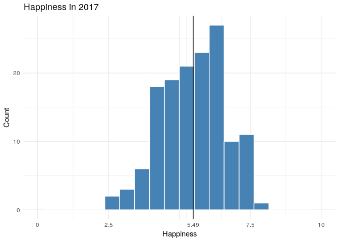
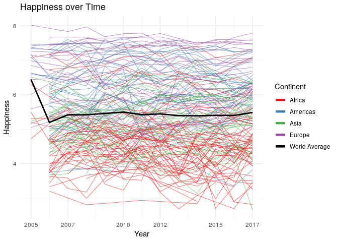
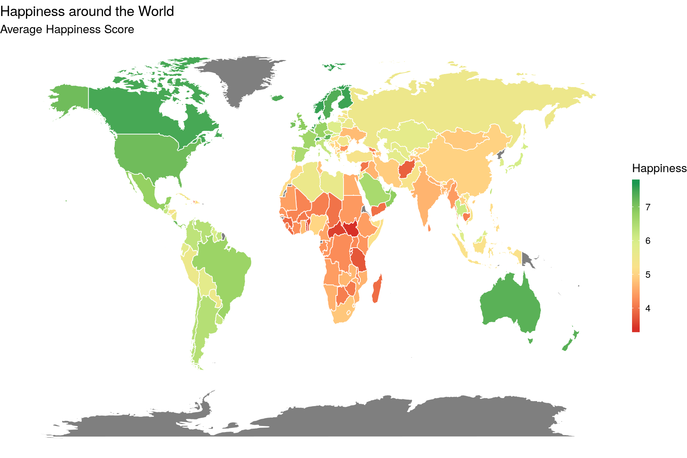
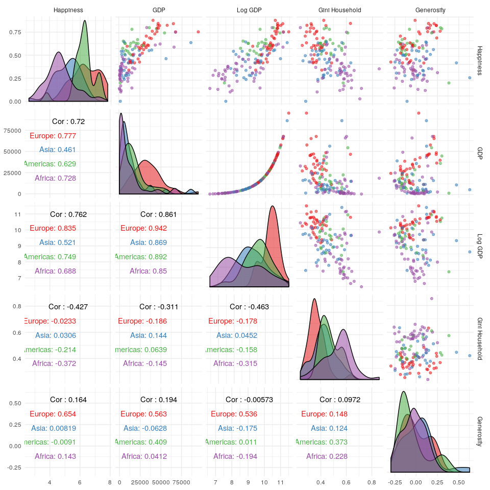
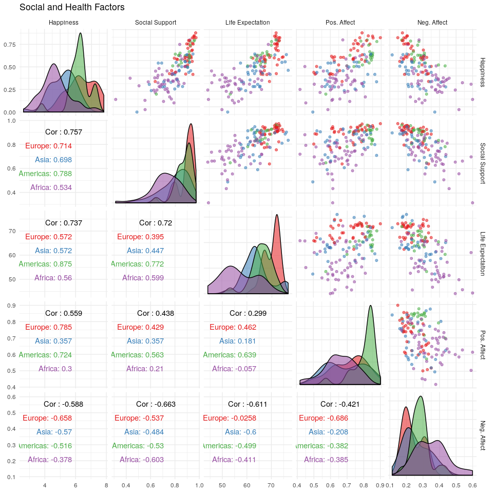
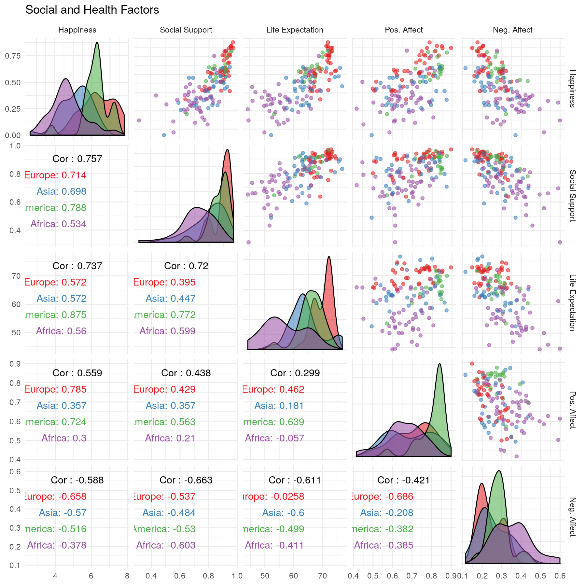
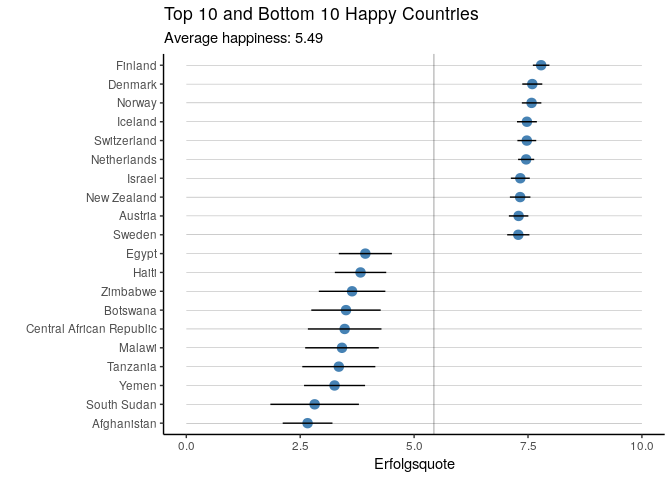
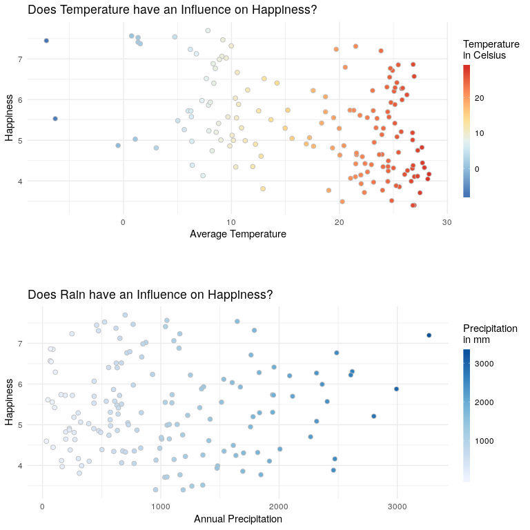
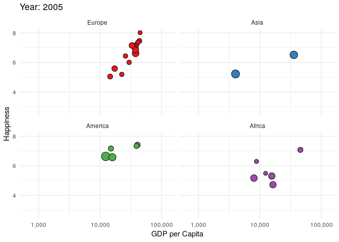

Happiness World Report - Exploratory Analysis
================
Corrie
February 23, 2019

The Data
--------

We will be using the data as provided by the World Happiness Report. The report from 2018 can be found [here](https://s3.amazonaws.com/happiness-report/2018/CH2-WHR-lr.pdf).

For the happiness score, respondents are asked where they stand on the *Cantril Ladder*. The Cantril Ladder consists of 10 steps, where the top is your best possible life and the bottom the worst possible life.

In this report, the scale goes from 0 to 10, that is, 0 is the worst possible life and 10 the best possible.

The responses are averaged on a country-year level. The report also includes variables that could explain the differences in the happiness scores. Note that these explanatory variables were not used to compute the happiness score. A detailed description of these additional variables, their sources as well as number of respondents per year and country can be found [here](https://s3.amazonaws.com/happiness-report/2018/Appendix1ofChapter2.pdf).

The supporting data also includes a region indicator for the different countries. We can roughly sort these region indicators to their continents which makes it easier for plotting later. Note that Australia and New Zealand are in the same region as the US and Canada and thus landed on the continent Americas.

The World Happiness Report only provides the Log of the GDP and by the time of publication, the GDP of 2017 wasn't available yet and extrapolated in the report. We can use the updated version of the GDP as provided by the [World Bank](https://data.worldbank.org/indicator/NY.GDP.PCAP.PP.KD). We use the GDP per capita in purchasing power parity (PPP) at constant 2011 international dollar prices.

How happy are people around the world?
--------------------------------------

So before we look at the explaining factors, let's have a look how happy people are in general around the World.

Even thought the ladder goes from 0 to 10, the worst average rating a country can have is around 2.5 and the best rating is around 7.6. On average, people seem to be more on the happier side.

### Happiness over Time

An interesting question is here, did happiness improve over time? The report goes back to 2005 (though many countries are only included later) and the newest observation is from 2017.

It seems that overall and for most countries, there is not much of a trend in the happiness score. The happiness drop at the year 2006 seems to be mostly due because that year more countries were included than in the year before. The top happiness scores seems to be dominated by European countries and the bottom scores are dominated by African countries. We can also see some African countries in the top range.

### Happiness throughout the World

Let's have a closer look how the happiness scores are distributed geographically over the world. Since there didn't seem too much change in the happiness scores, we simply take the average for each country over all reported years. This way, we can include most countries since some countries have missing observations in some years.

Most Western Countries seem to get a quite high happiness score in this report while many countries in Africa have quite low scores.

Interesting are here in particular countries such as Yemen, Afghanistan or Cambodia that have very low scores but are surrounded by countries with higher scores (Saudi Arabia and Oman for Yemen; Turkmenistan and Pakistan for Afghanistan; Thailand and Vietnam for Cambodia). Both Yemen and Afghanistan have been in the news the last decades because of ongoing conflicts and crises. While Cambodia has been stable for some time by now, their conflicts during the 90s still seem to affect their happiness level today.

### Happiest and Unhappiest countries

Which countries are the happiest and which the unhappiest countries?

Suporting Factors
-----------------

### Economic Factors

Let's have a closer at the supporting factors that are included in the report. Two different economical indicators are provided:

-   `gdp`, the GDP per capita in purchasing power parity at constant 2011 international $.
-   `gini_household`, the household Gini index which measures the inequality among household incomes. A Gini index of 0 signifies perfect equality while a index of 1 means maximal inequality.

The `generosity` factor is computed with relation to the GDP: People were asked if they have donated to charity in the past month. The binary answers are then aggregated on a national level and regressed on by the GDP per capita. The generosity value is then the residual, that is, it gives an indicator if people give more or less money to charity than would be expected by their GDP.

We can see that the GDP has a positive correlation with the happiness score while the Gini index has a negative correlation. Generosity only seems to be positively correlated with happiness for European countries.

### Social and Health Factors

Three social factors are included in the data:

-   `social`, the answer to the question "If you were in trouble, do you have relatives or friends you can count on to help you whenever you need them, or not?", aggregated on a national level.
-   `health`, the Healthy Life Expectation, gives the number of years a person is expected to live in good health.
-   `pos_affect` is the average to three questions about how a person felt the previous day: Were they happy, laughed, smiled and were mostly enjoying themselves.
-   `neg_affect` is the average to three questions about how a person felt the previous day: Did they worry, were they sad or angry.

Except for negative affect are all factors strongly positively correlated with happiness. Negative affect is obviously negatively correlated with happiness.

### Political Factors

The data provides 5 political factors:

-   `freedom`, the national average to the binary question "Are you satisfied or dissatisfied with your freedom to choose what you do with your life?"
-   `corruption`, a perception of corruption in the country. Computed as the national average to the two questions "Is corruption widespread throughout the government/business or not?"
-   `gov_confidence`, how confident are people in the national government. National average to the binary question "Do you have confidence in the national government?", as such the variable is between 0 and 1.
-   `democracy` and `delivery`, democratic and delivery quality measures of governance are based on Worldwide Governance Indicators. Democracy and Delivery are strongly positively correlated, so we'll omit the variable `delivery` from the pairs plot. Both indicators are on a scale roughly with mean zero and a standard deviation of 1.

The variables freedom and democracy have both a positive correlation with happiness while perception of corruption has a negative correlation with happiness. Interestingly, confidence in the government has an overall negative correlation with happiness but a positive correlation for all continents except Africa.

Additional Data
---------------

It is relatively easy and straight-forward to add additional data. Any data that can be found on a country-level can be added: Does happiness correlate with the access to open data? Are people in rainy or cold countries less happy? Etc etc. To be able to join additional data, it should be available for most countries and have either the ISO-country code or have the same names as this data set (if not, some manual adaptions need to be made).

### Temperature and Rain Data

[Climate Data](https://datacatalog.worldbank.org/dataset/climate-change-knowledge-portal-historical-data) can be found on the web page of the World Bank. They provide both the average temperature per year and the total yearly precipitation.

### Population Data and the famous Gapminder Plot

We can also add population data and thus recreate the famous gapminder plot, albeit with happiness instead of with life expectancy on the y-axis. [Population data](https://data.worldbank.org/indicator/sp.pop.totl) is also provided by the World Bank.

We can see that most countries increase their happiness score with increasing GDP (or decreasing happiness with decreasing GDP). However, there are also some countries that see a decrease or increase in happiness without changes in the GDP.
