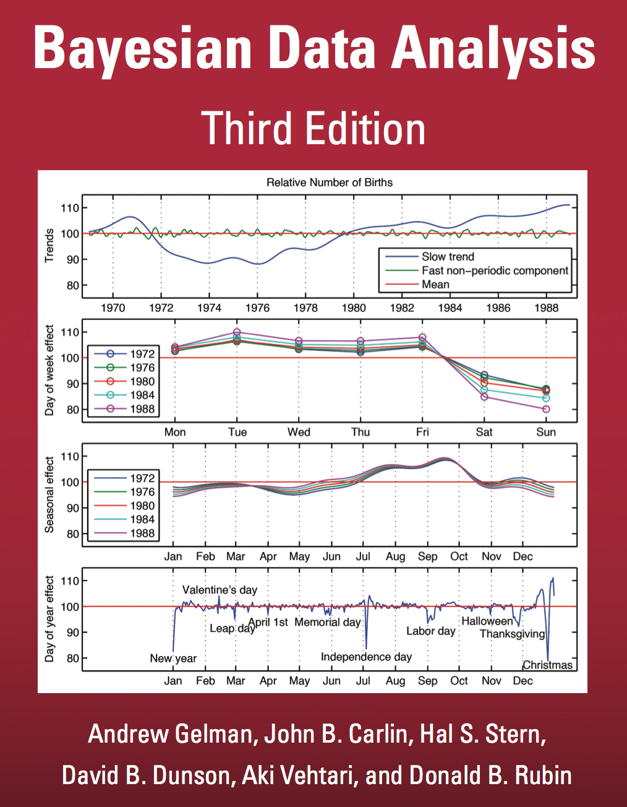

```{r setup, include=FALSE}
knitr::opts_chunk$set(echo = TRUE, comment=NA)
```
```{r xaringan-themer, include = FALSE}
library(xaringanthemer)

duo(primary_color = "#1F4257", secondary_color = "#F97B64",
  header_font_google = google_font("Josefin Sans"),
  text_font_google   = google_font("Montserrat", "300", "300i"),
  code_font_google   = google_font("Droid Mono")
)
write_extra_css(list(".highlight" = list(color = "#F97B64")))
```
# Organisational

<br>


- `r icon::fa("slack")` Slack: [berlinbayesians.slack.com/]()


<br>

- `r icon::fa("wifi")` WiFi: .highlight[ Hypoport-Hotspot ]


<br>

- `r icon::fa("github")` Repo: [https://github.com/corriebar/Berlin-Bayesians-Hands-On]()


---

# Next Meetup


### Save the Date: 26th of March

- Speaker: __Richard McElreath__

- Author of Statistical Rethinking

- Details: TBA

---
# Reading Group



---
# How to get started with ..

- PyMC


---

# Lightning Talks


---

# Short Introduction to the Data
[Analysis](EDA.md)

---
## Happy coding


